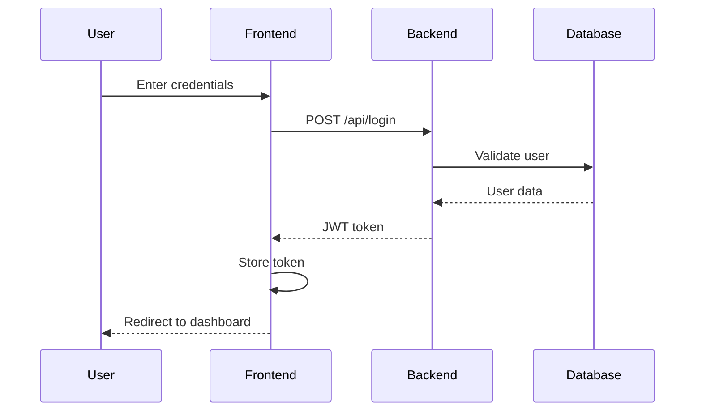
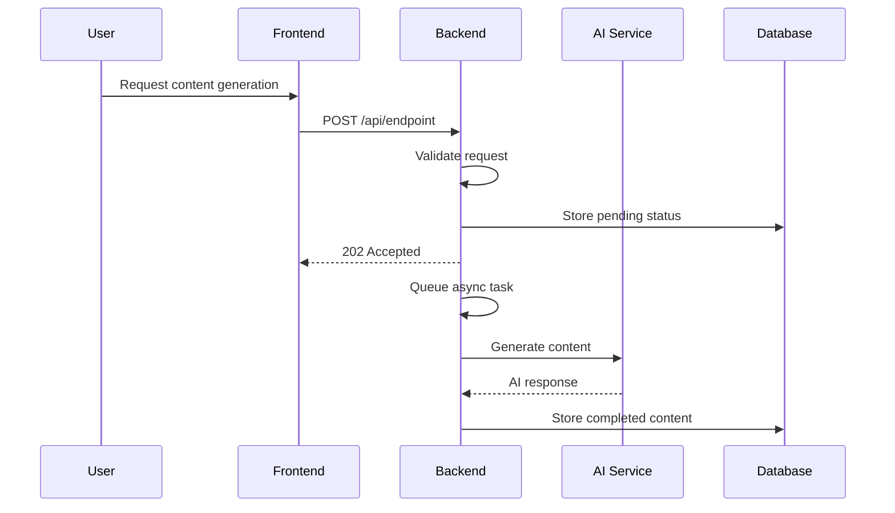

# Electron Architecture Overview

## System Design Philosophy

Electron is built with **AI-friendly architecture** principles:

1. **Modular Components**: Each phase (auth, analysis, characters, ads) is independently deployable
2. **Clear Data Flow**: Unidirectional data flow with well-defined interfaces
3. **Comprehensive Documentation**: Extensive docs for maintainability
4. **Scalable Patterns**: Serverless-first design with horizontal scaling
5. **Type Safety**: Full TypeScript implementation with strict typing

## High-Level Architecture

```
┌─────────────────┐    ┌─────────────────┐    ┌─────────────────┐
│   Frontend      │    │   Backend API   │    │   Database      │
│   (Next.js)     │◄──►│   (Workers)     │◄──►│   (D1 SQLite)   │
│                 │    │                 │    │                 │
│ • React SPA     │    │ • REST API      │    │ • Users         │
│ • Static Export │    │ • Auth Middleware│    │ • Workspaces    │
│ • TypeScript    │    │ • Async Processing│    │ • Analyses      │
│ • Tailwind CSS  │    │ • CORS Handling  │    │ • Characters    │
└─────────────────┘    └─────────────────┘    │ • Ads           │
                                              └─────────────────┘
┌─────────────────┐                           ┌─────────────────┐
│   AI Service    │◄──────────────────────────┤   CloudFlare    │
│   (Workers AI)  │                           │   Platform      │
│                 │                           │                 │
│ • Llama-3.1-8B  │                           │ • Workers       │
│ • Async Tasks   │                           │ • D1 Database   │
│ • Prompt Engineering│                       │ • Pages         │
└─────────────────┘                           │ • Global CDN    │
                                              └─────────────────┘
```

## Component Architecture

### Frontend Architecture

#### File Structure
```
frontend/
├── src/app/                 # Next.js App Router
│   ├── layout.tsx          # Root layout with providers
│   ├── page.tsx           # Landing page
│   ├── dashboard/         # Main application
│   │   └── page.tsx       # Dashboard with sidebar
│   ├── login/             # Authentication pages
│   └── register/
├── components/            # Reusable components (future)
├── lib/                   # Utility functions
└── styles/               # Global styles
```

#### State Management
- **Local State**: React useState for component state
- **Server State**: Direct API calls (no client-side caching)
- **Authentication**: JWT tokens stored in localStorage
- **Data Flow**: Props down, events up pattern

#### Routing Strategy
- **Static Export**: All routes pre-rendered for optimal performance
- **Client Navigation**: React state manages route changes
- **Authentication Guards**: Client-side route protection

### Backend Architecture

#### API Design Principles
- **RESTful Endpoints**: Standard HTTP methods and status codes
- **Resource-Based URLs**: `/api/{resource}` pattern
- **Consistent Responses**: Standardized JSON response format
- **Error Handling**: Descriptive error messages with appropriate status codes

#### Authentication Flow
```
1. User submits credentials
2. Server validates and generates JWT
3. Client stores token in localStorage
4. Subsequent requests include Bearer token
5. Server validates token on protected routes
6. Token expiration handled client-side
```

#### Async Processing Pattern
```
1. Client initiates long-running task (analysis/character/ad generation)
2. Server immediately returns 202 Accepted
3. Server queues task using ctx.waitUntil()
4. Client polls for status updates
5. Server updates database when complete
6. Client refreshes data on next poll
```

### Database Design

#### Normalization Strategy
- **Third Normal Form (3NF)**: Eliminates transitive dependencies
- **Foreign Key Constraints**: Maintains referential integrity
- **Indexing Strategy**: Primary keys and essential foreign keys indexed
- **Data Types**: Appropriate SQLite types for performance

#### Schema Evolution
- **Migration Scripts**: SQL files for schema changes
- **Backward Compatibility**: Additive changes preferred
- **Data Integrity**: Constraints prevent invalid states

## Data Flow Patterns

### User Authentication Flow


### AI Content Generation Flow


## Security Architecture

### Authentication & Authorization
- **JWT Tokens**: Stateless authentication with expiration
- **Password Security**: SHA-256 hashing (upgradeable to bcrypt)
- **Session Management**: Server-side session validation
- **User Isolation**: Database-level row security via user_id filters

### API Security
- **CORS Protection**: Configured origins and headers
- **Input Validation**: Server-side validation for all inputs
- **SQL Injection Prevention**: Parameterized queries only
- **Rate Limiting**: CloudFlare platform-level protection

### Data Protection
- **Encryption**: JWT tokens with proper signing
- **Access Control**: User-scoped data access
- **Audit Trail**: Creation timestamps on all records

## Performance Optimizations

### Frontend Optimizations
- **Static Generation**: Pre-built pages for instant loading
- **Code Splitting**: Automatic chunking by Next.js
- **Image Optimization**: Future-ready for media assets
- **Bundle Analysis**: Minimal JavaScript footprint

### Backend Optimizations
- **Edge Computing**: CloudFlare global network
- **Async Processing**: Non-blocking AI operations
- **Connection Pooling**: D1 built-in optimization
- **Caching Strategy**: Database result caching

### Database Optimizations
- **Query Optimization**: Efficient SELECT statements
- **Indexing Strategy**: Primary and foreign key indexes
- **Connection Limits**: D1 handles connection management
- **Read/Write Patterns**: Optimized for OLTP workload

## Scalability Considerations

### Horizontal Scaling
- **Stateless Design**: No server-side sessions
- **Database Scaling**: D1 global replication
- **CDN Distribution**: Static assets globally cached
- **API Scaling**: Workers auto-scale per request

### Vertical Scaling
- **Memory Management**: Minimal in-memory state
- **CPU Optimization**: Efficient async/await patterns
- **I/O Optimization**: Batched database operations

### Growth Patterns
- **User Growth**: Database partitioning by user_id
- **Content Growth**: Efficient pagination and filtering
- **AI Usage**: Asynchronous processing prevents bottlenecks

## Error Handling & Monitoring

### Error Boundaries
- **Frontend**: React error boundaries for UI stability
- **Backend**: Try-catch blocks with proper error responses
- **Database**: Transaction rollbacks on failures

### Logging Strategy
- **Application Logs**: Console logging for debugging
- **Error Tracking**: Structured error responses
- **Performance Monitoring**: Response time tracking

### Debugging Tools
- **Development Mode**: Enhanced error messages
- **API Testing**: Direct endpoint testing capabilities
- **Database Inspection**: D1 console access for queries

## Deployment Architecture

### CI/CD Pipeline
```
Code Commit → Build → Test → Deploy
    ↓         ↓      ↓       ↓
GitHub   →  Wrangler → Manual → Production
```

### Environment Strategy
- **Development**: Local Wrangler dev server
- **Staging**: Separate CloudFlare account/project
- **Production**: Live application with monitoring

### Rollback Strategy
- **Instant Rollback**: Workers version management
- **Database Rollback**: Schema migration scripts
- **Content Rollback**: Static asset versioning

## AI Integration Patterns

### Prompt Engineering
- **Structured Prompts**: Consistent format for reliable outputs
- **Context Injection**: Brand analysis informs character creation
- **Output Parsing**: JSON parsing with fallback handling
- **Error Recovery**: Graceful degradation on AI failures

### Async Processing
- **Queue Management**: ctx.waitUntil() for background tasks
- **Status Tracking**: Database state management
- **Timeout Handling**: Reasonable timeouts for AI calls
- **Retry Logic**: Future enhancement for reliability

## Future Architecture Extensions

### Microservices Evolution
- **Service Boundaries**: Clear separation of concerns
- **API Gateway**: Centralized request routing
- **Event-Driven**: Pub/sub for cross-service communication

### Advanced Features
- **Real-time Updates**: WebSocket integration
- **File Uploads**: R2 storage integration
- **Analytics**: Usage tracking and reporting
- **Multi-tenancy**: Team collaboration features

### Performance Enhancements
- **Caching Layer**: Redis for frequently accessed data
- **CDN Optimization**: Advanced caching strategies
- **Database Optimization**: Query optimization and indexing

## Development Workflow

### Local Development
```bash
# Start backend
cd backend && npm run dev

# Start frontend (new terminal)
cd frontend && npm run dev

# Database operations
npx wrangler d1 execute electron-db --command="SELECT * FROM users;"
```

### Testing Strategy
- **Unit Tests**: Component and utility function testing
- **Integration Tests**: API endpoint testing
- **E2E Tests**: User workflow automation
- **Performance Tests**: Load testing for scaling validation

### Code Quality
- **TypeScript**: Strict type checking enabled
- **ESLint**: Code quality and consistency
- **Prettier**: Automated code formatting
- **Git Hooks**: Pre-commit quality checks

This architecture provides a solid foundation for AI-powered marketing tools with room for growth and scalability.
