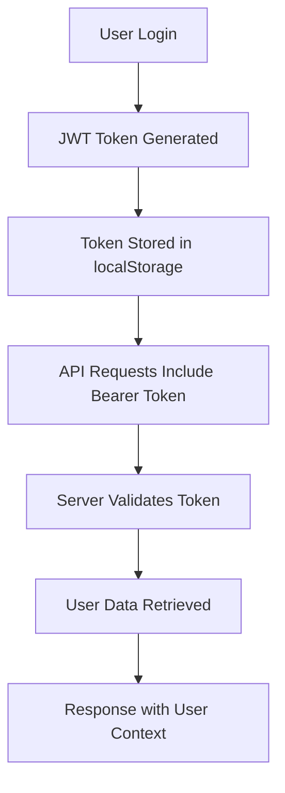
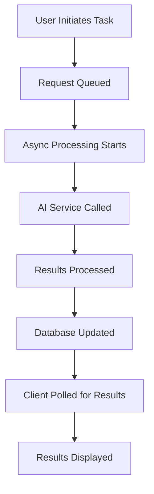
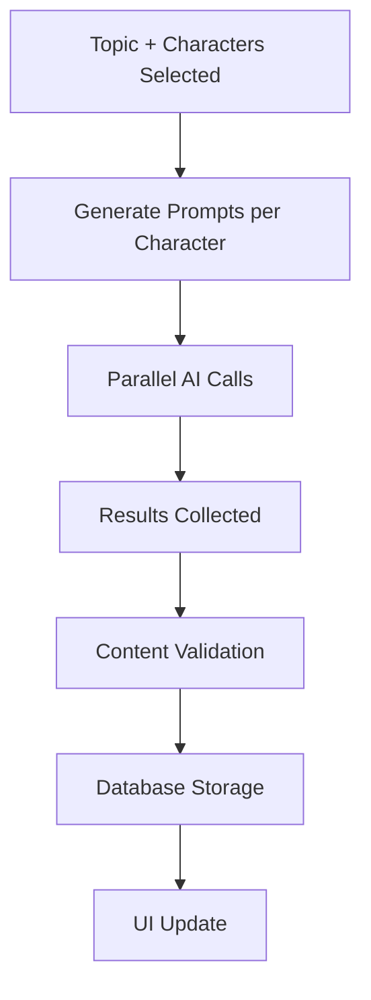

# Electron Marketing Tool - Complete System Guide

## 🎯 System Overview

Electron is a **production-ready AI-powered marketing automation platform** that transforms how brands create content. Built with modern serverless architecture, it provides a complete workflow from brand discovery to content generation.

### Core Philosophy
- **AI-First**: Every feature leverages artificial intelligence
- **User-Centric**: Intuitive workflows for marketing professionals
- **Scalable**: Serverless architecture that grows with demand
- **Maintainable**: Clean code with comprehensive documentation

---

## 🚀 User Journey & Workflow

### Phase 1: Onboarding & Setup
```
User Registration → Email Verification → Dashboard Access
                     ↓
            Workspace Creation → Brand Setup
```

**What happens technically:**
1. User registers with email/password
2. System creates JWT token for authentication
3. User creates first workspace (isolated environment)
4. Database initializes user-specific tables

### Phase 2: Brand Discovery
```
URL Input → AI Analysis → Brand Intelligence Report
```

**Technical flow:**
1. User submits website URL
2. System fetches page content (simple HTML parsing)
3. CloudFlare AI analyzes content with Llama-3.1-8B
4. Results stored in `brand_analyses` table
5. User reviews AI-generated insights

### Phase 3: Brand Voice Development
```
Brand Analysis → AI Character Generation → Review & Approval
```

**Technical implementation:**
1. AI generates 3 distinct brand characters
2. Each character has unique personality traits
3. Characters stored in `characters` table with status
4. User approves/rejects characters
5. Approved characters become available for content creation

### Phase 4: Content Generation
```
Topic + Characters → AI Content Creation → Multi-Format Output
```

**Content pipeline:**
1. User selects approved characters
2. Chooses content type (LinkedIn, Twitter, Email)
3. Specifies topic and quantity
4. AI generates content per character personality
5. Results stored and displayed for use

---

## 🏗 Technical Architecture Deep Dive

### System Components

#### Frontend (Next.js + TypeScript)
```
src/app/
├── layout.tsx          # Global providers & metadata
├── page.tsx           # Landing page with feature overview
├── dashboard/         # Main application interface
│   └── page.tsx       # Workspace dashboard with all features
├── login/             # Authentication pages
├── register/          # User registration
└── globals.css        # Tailwind + custom styles
```

**Key Patterns:**
- **Static Export**: All pages pre-rendered for performance
- **Client Components**: Interactive features use 'use client'
- **State Management**: React hooks with localStorage persistence
- **API Integration**: Direct fetch calls with error handling

#### Backend (CloudFlare Workers)
```
src/index.ts           # Main request handler
├── Authentication     # JWT token validation
├── Workspace APIs     # CRUD operations
├── Brand Analysis     # URL processing & AI analysis
├── Character APIs     # Generation & management
├── Ad Generation      # Content creation
└── CORS Handling      # Cross-origin requests
```

**Request Flow:**
```
HTTP Request → CORS Check → Auth Middleware → Route Handler → Database → Response
```

#### Database (CloudFlare D1)
```sql
-- Core entities with relationships
users ← workspaces ← brand_analyses
                    ← characters
                    ← ads
```

**Data Integrity:**
- Foreign key constraints maintain relationships
- User isolation prevents data leakage
- Indexed queries for performance
- Migration-ready schema design

### AI Integration Strategy

#### CloudFlare Workers AI
- **Model**: Llama-3.1-8B (balanced performance/cost)
- **Usage**: Three main applications
- **Optimization**: Structured prompts for consistent output

#### AI Pipeline Architecture
```
User Input → Prompt Engineering → AI Processing → Output Parsing → Data Storage
```

#### Prompt Engineering Patterns

**Brand Analysis:**
```
System: "You are a marketing expert analyzing a brand website..."
User: "Analyze this content and provide insights on: [content]"
```

**Character Generation:**
```
System: "Create compelling brand characters based on: [brand data]"
User: "Generate 3 characters with distinct personalities"
```

**Content Creation:**
```
System: "You are a [character personality] copywriter..."
User: "Write a [content_type] about [topic] in character voice"
```

### Security Implementation

#### Authentication System
```javascript
// JWT token generation
const token = await generateToken(); // 256-bit crypto random

// Password security
const hash = await crypto.subtle.digest('SHA-256', password);

// Session validation
const session = await validateToken(token);
```

#### Data Protection
- **Input Sanitization**: All user inputs validated server-side
- **SQL Injection Prevention**: Parameterized queries only
- **CORS Protection**: Configured origins and methods
- **User Isolation**: Database queries scoped by user_id

#### API Security
```javascript
// Authentication middleware
async function authenticateUser(request) {
  const token = request.headers.get('Authorization')?.replace('Bearer ', '');
  if (!token) return null;

  const session = await DB.prepare('SELECT user_id FROM sessions WHERE id = ? AND expires_at > ?')
    .bind(token, new Date().toISOString()).first();

  return session?.user_id || null;
}
```

---

## 🔄 Data Flow & State Management

### User Session Flow


### AI Processing Flow


### Content Generation Pipeline


---

## 🧪 Testing Strategy & Infrastructure

### Test Architecture
```
tests/
├── test_runner.js      # Main orchestrator
├── test_utils.js       # Shared testing utilities
├── individual_tests/   # Feature-specific tests
└── package.json        # Test execution scripts
```

### Test Categories

#### End-to-End Tests
- **Authentication Flow**: Registration → Login → Token Validation
- **Workspace Management**: CRUD operations with user isolation
- **Brand Analysis**: URL submission → AI processing → Results display
- **Character Workflow**: Generation → Review → Approval → Storage
- **Ad Creation**: Character selection → Content generation → Display

#### Integration Tests
- **API Endpoint Validation**: Request/response format verification
- **Database Operations**: CRUD operations and relationship integrity
- **AI Service Integration**: Prompt/response validation
- **Authentication Middleware**: Token validation and user context

#### Performance Tests
- **Response Times**: API endpoint performance monitoring
- **Concurrent Users**: Multi-user scenario simulation
- **AI Processing**: Generation time and success rate tracking

### Test Execution
```bash
# Run complete test suite
cd tests && npm test

# Run specific features
npm run test:auth       # Authentication only
npm run test:workspaces # Workspace operations
npm run test:analysis   # AI analysis pipeline
```

---

## 🚀 Deployment & DevOps

### Environment Strategy
```
Development → Staging → Production
     ↓           ↓         ↓
Local Dev  → CloudFlare → Live App
```

### Deployment Pipeline
```bash
# Backend deployment
cd backend
npm run deploy  # CloudFlare Workers

# Frontend deployment
cd frontend
npm run build
npx wrangler pages deploy out --project-name electron-frontend
```

### Infrastructure as Code
```toml
# wrangler.toml - Infrastructure configuration
name = "electron-backend"
compatibility_date = "2023-12-01"

[[d1_databases]]
binding = "DB"
database_name = "electron-db"

[ai]
binding = "AI"
```

### Monitoring & Observability
- **CloudFlare Analytics**: Request metrics and performance
- **Error Tracking**: Console logs and structured error handling
- **AI Usage Monitoring**: Token consumption and success rates
- **User Analytics**: Feature usage and conversion tracking

---

## 🔧 Maintenance & Extension Guide

### Adding New Features

#### 1. Database Schema Updates
```sql
-- Add new table or columns
ALTER TABLE workspaces ADD COLUMN description TEXT;

-- Update schema.sql for documentation
```

#### 2. API Endpoint Implementation
```javascript
// Add new route in index.ts
if (url.pathname === '/api/new-feature') {
  // Implementation
}
```

#### 3. Frontend Integration
```javascript
// Add new API calls
const response = await fetch('/api/new-feature', {
  method: 'POST',
  headers: { 'Authorization': `Bearer ${token}` },
  body: JSON.stringify(data)
});
```

#### 4. Testing Addition
```javascript
// Add to test_utils.js
async function testNewFeature(token, data) {
  // Implementation
}
```

### Code Quality Standards

#### TypeScript Requirements
- **Strict Mode**: All type checking enabled
- **Interface Definitions**: Complex objects properly typed
- **Error Handling**: Try/catch with specific error types
- **Null Safety**: Proper null/undefined checking

#### Documentation Standards
- **JSDoc Comments**: All exported functions documented
- **README Updates**: New features documented
- **API Reference**: Endpoint documentation maintained
- **Change Logs**: All changes tracked

### Performance Optimization

#### Frontend Optimizations
- **Bundle Analysis**: Monitor bundle size
- **Lazy Loading**: Components loaded on demand
- **Image Optimization**: Future media assets
- **Caching Strategy**: API response caching

#### Backend Optimizations
- **Query Optimization**: Efficient database queries
- **Async Processing**: Non-blocking operations
- **Memory Management**: Minimal in-memory state
- **Edge Computing**: Global CDN utilization

---

## 🎯 Scaling Strategy

### Horizontal Scaling
- **Workers**: Automatic scaling based on load
- **Database**: D1 global replication
- **CDN**: Worldwide content distribution
- **AI**: On-demand processing capacity

### Vertical Scaling
- **Memory**: Optimize for CloudFlare limits
- **CPU**: Efficient async/await patterns
- **Storage**: Database optimization
- **Network**: Minimize payload sizes

### Growth Planning
- **User Growth**: Database partitioning strategies
- **Content Growth**: Pagination and archiving
- **AI Growth**: Model optimization and caching
- **Feature Growth**: Modular architecture for extensions

---

## 🚨 Troubleshooting Guide

### Common Issues

#### Authentication Problems
```javascript
// Check token validity
const token = localStorage.getItem('token');
console.log('Token exists:', !!token);

// Verify token format
if (!token?.startsWith('eyJ')) {
  console.error('Invalid token format');
}
```

#### API Request Failures
```javascript
// Check network connectivity
fetch('/api/health')
  .then(res => console.log('API reachable:', res.ok))
  .catch(err => console.error('Network error:', err));
```

#### Database Connection Issues
```javascript
// Verify D1 binding
console.log('DB available:', typeof env.DB !== 'undefined');
```

#### AI Processing Delays
```javascript
// Check AI service status
// Implement retry logic for failed requests
const maxRetries = 3;
let attempt = 0;

while (attempt < maxRetries) {
  try {
    const result = await callAIService();
    break;
  } catch (error) {
    attempt++;
    if (attempt >= maxRetries) throw error;
    await sleep(1000 * attempt); // Exponential backoff
  }
}
```

---

## 📈 Future Roadmap

### Phase 5: Advanced AI Features
- **Custom AI Models**: Fine-tuned brand-specific models
- **Multi-language Support**: Content generation in multiple languages
- **A/B Testing**: AI-generated content optimization

### Phase 6: Social Media Integration
- **Auto-posting**: Direct publishing to social platforms
- **Scheduling**: Content calendar and automated posting
- **Analytics**: Performance tracking and optimization

### Phase 7: Team Collaboration
- **Multi-user Workspaces**: Team access and permissions
- **Content Approval**: Review workflows for brand compliance
- **Version Control**: Content iteration and history

### Technical Enhancements
- **Real-time Updates**: WebSocket integration
- **File Uploads**: PDF and image processing
- **Advanced Analytics**: Usage patterns and insights
- **API Rate Limiting**: Advanced quota management

---

## 🎉 Conclusion

Electron represents a **complete AI-powered marketing solution** that demonstrates:

- **Modern Architecture**: Serverless, scalable, and maintainable
- **AI Integration**: Practical implementation of AI in business workflows
- **User Experience**: Intuitive interface with powerful capabilities
- **Developer Experience**: Well-documented, testable, and extensible codebase

The system serves as a **blueprint for AI-powered SaaS applications**, combining cutting-edge technology with practical business value. Every component is designed for reliability, scalability, and ease of maintenance.

**Ready for production. Ready for growth. Ready for the future.** 🚀
